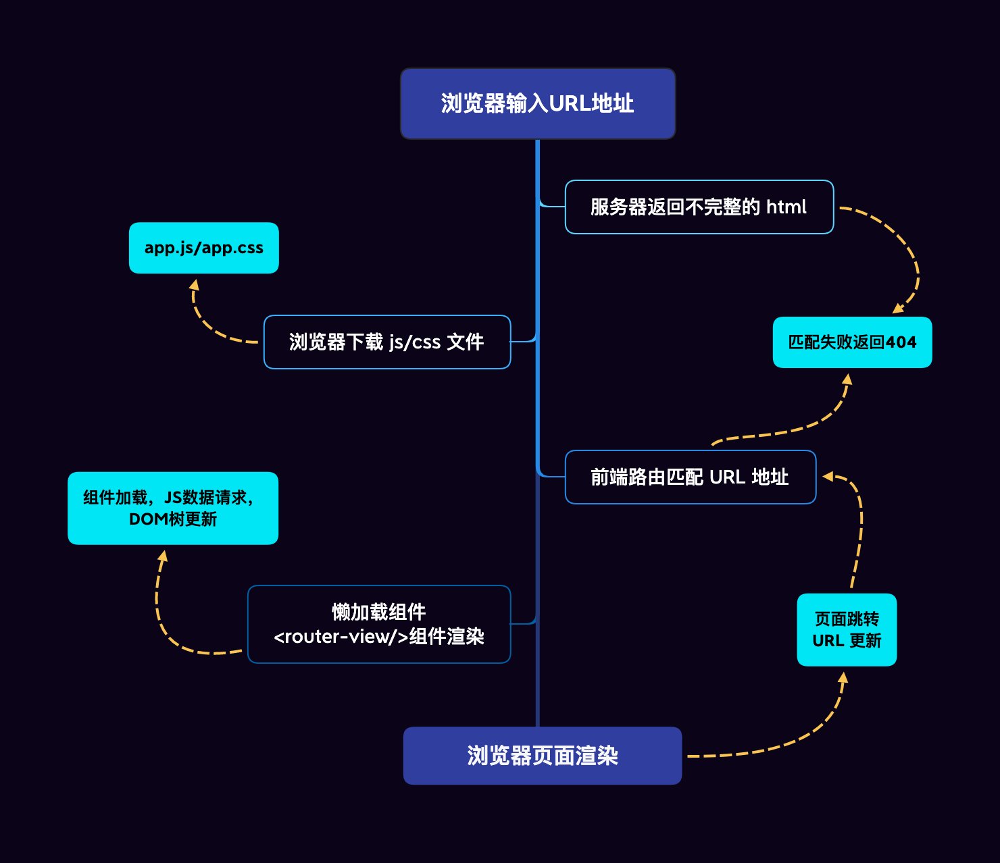

# SPA 路由设计哲学

## 引言

在我们日常项目的开发之中，构建完成项目脚手架后，我们所做的第一件事情必然是设计与构建项目路由。在过去的半年中，对于新柚杯系统的开发我一直处于一种踟蹰与迷茫之中，很大程度上是因为受到如何设计一个美观实用且易读的路由的困扰。更难受的是无论是科协还是青柚，无一项目的路由设计可供我参考（邮你来办的路由逻辑极为简单，完全不足以作为参考模板），而当我着手构建项目页面逻辑时同时发现路由逻辑在很大程度上会左右整个项目的文件组织与架构。**路由设计**的重要性是不言而喻的。感谢新柚杯与邮你来办的路由设计所引发的我的思考——

此文籍此探讨何为“好”的，或者说是“合理”的路由设计

同时还要感谢校科协前前任技术中心分管主席、ACM 校队前队长、被微软中国（苏州）实习免面试录用的优秀的**柏广凡**同学以及校科协SAST工作室主任、λ组讲师**宣孝卿**同学对本文的诞生所给予的帮助。

## \*什么是前端

广义前端：一切你所看到的应用界面（GUI）

狭义前端：我们在浏览器中所打开的网页（包括开放的 PWA 技术所构建的网页应用）（Electron、React Native 等框架的崛起也使得传统意义上的前端技术在移动端及桌面端被广泛应用）~~（特别是 HomoOS）~~（还有那个\*……&￥%&的小程序）

## \*前端发展简史


### \*SSR 与 CSR

SSR：Server-Side Rendering/Server-Side Scripting

CSR：Client-Side Rendering

本质上浏览器只能渲染静态网页文件，因此 SSR 与 CSR 的根本区别在于生成静态文件的地方不同（在服务器上/在浏览器中）

### \*SPA

**单页应用**（英语：single-page application，缩写**SPA**）是一种网络应用程序或网站的模型，它通过动态重写当前页面来与用户交互，而非传统的从服务器重新加载整个新页面。这种方法避免了页面之间切换打断用户体验，使应用程序更像一个桌面应用程序。页面在过程中的任何时间点都不会重新加载，也不会将控制转移到其他页面。（from Wikipedia）

**在网页浏览器中使用 JavaScript 显示用户界面（UI）、运行应用程序逻辑，以及与 Web 服务器通信。**

最显而易见的缺点则是单页应用的第一页加载会比基于服务器的应用慢。（因此出现了以 Next.js 为代表的 SSR 框架以试图解决此问题）

▲与之对应的**传统页面**简单说就是在浏览器输入网址后发起请求，返回来的 HTML 页面是最终呈现的效果，那就是 DOM 直出。并且每次点击页面跳转，都会重新请求 HTML 资源。

### 一些奇怪的东西

~~来点柏老板爆论~~

~~（不过我确实认为这可能是未来技术发展的一个方向/趋势，譬若 GraphQL 种种）~~


## 什么是路由

在最早静态网页时代，路由就是用来跟服务器进行交互的一种方式，通过不同的路径，来**请求不同的资源，请求不同的页面便是路由的其中一种功能**。

### 后端路由

当 Perl、PHP 为代表的动态网页或者说“前”服务端渲染（SSR）时代来临之初，路由与静态网页时代并无二致，对于用户而言唯一的不同可能就是网页链接最后的 .html 变为了 .php。在 Apache 收到 example.com/index.php 的请求时，通过 CGI\* 调用 PHP 解释器引擎解释程序，执行 index.php 文件中的代码，然后将代码返回的数据（一般是渲染好的 html 页面）返回给客户端。

\*CGI 为提供网络服务而执行控制台应用（CLI）的程序，通常情况下，一次请求对应一个CGI 脚本的执行，生成一个 HTML 文件。


2010 年前后，ASP.NET MVC、PHP Laravel、Ruby on Rails 等 **MVC 框架**先后涌现 ~~（虽然此前 MFC、WinForm 等早就已经让 MVC 在桌面端遍地开花了）~~，View 与 Model 逐渐分离，此时一套现代路由机制的出现几乎可以说是呼之欲出的。Laravel 和 ThinkPHP 等框架都提供了一套自己的路由解析方案，在此时路由全权由服务端负责，后端对用户传递的 url 进行正则匹配解析后渲染对应的 HTML 页面返回给客户端。


### 前端路由

随后前后端紧随桌面开发 WPF 的步伐，也来到了 **MVVM 的时代**。前端领域 jQuery Ajax 的崛起与RESTful API 的广泛应用，使得前后端分离架构成为了一种流行的趋势。经此一役，路由这个概念似乎很少再为后端所提起（@夏昊南），事实上前后端分离同样也带来了前后端路由的分离，不过不同的是前端路由最终进化为了现在的前端单页面应用（SPA）路由，而后端路由则退化为了 API 路由。


**当下 SPA 所谓的前端路由核心也已不再是通过请求不同的资源来请求不同的页面，而是通过路由映射，在 URL 改变时页面并不进行整体页面的刷新，转而用 JavaScript 操作 DOM 加载对应组件页面作为替代，路由基本上就是路径和组件之间的映射关系了。**



## 路由模式

为什么我们要引入路由模式的概念？

上面我们也提到，根据单页应用（SPA）模型的定义，它只有“单个页面”，因此这打破了浏览器为页面历史记录导航所设计的“前进/后退”功能。当用户按下后退按钮时，可能会遇到可用性障碍，页面可能返回真正的上一个页面，而非用户所期望的上一个页面。（from Wikipedia）

为了解决上述问题，浏览器新增了如下功能以适应 SPA 的发展：

### Hash

e.g. https://www.example.com/#/home

一个完整的 URL 包括：协议、域名、端口、虚拟目录、文件名、参数、锚。


hash 值指的是 URL 地址中的锚部分，也就是 `#` 后面的部分。hash 也称作锚点，是用来做页面定位的，与 hash 值对应的 DOM id 显示在可视区内。在 HTML5 的 history 新特性出现前，基本都是使用监听 hash 值来实现前端路由的。hash 值更新有以下几个特点：

- hash 值是网页的标志位，HTTP 请求不包含锚部分，对后端无影响
- 因为 HTTP 请求不包含锚部分，所以 hash 值改变时，不触发网页重载
- 改变 hash 值会改变浏览器的历史记录
- 改变 hash 值会触发 `window.onhashchange` 事件

当井号 `#` 后面的路径发生变化时，浏览器并不会重新发起请求，而是会触发 `window.onhashchange` 事件，借此实现无刷新跳转的功能。通过 `location.hash` 则可以获取到当前的哈希路由参数。在 `history` 路由出现之前，开发者基本都是使用 hash 来实现前端路由的，**我个人认为这是基于 Ajax 的 SPA 诞生早期的一种过渡性路由模式。**（现在 hash 的片段标识符则一般回归本初被用于文档定位）

### History

e.g. https://www.example.com/home/posts

history 是 2016 年 w3c 在 H5 引入的新特性（`pushState` 和 `replaceState`）（允许浏览器端更新地址而不重新向后端发起请求），**也是我们现如今我们日常上网冲浪时最常见，项目开发中最常用，我个人最推荐使用的路由模式。**

**`History`** 接口允许操作浏览器的曾经在标签页或者框架里访问的会话历史记录。https://developer.mozilla.org/zh-CN/docs/Web/API/History

主要概念：**历史记录堆栈**

## 传参形式

### 概述

| 类型                | 形式           | 样例                                                                 |
| ------------------- | -------------- | -------------------------------------------------------------------- |
| ★URL Parameters     | /url/:id       | https://twitter.com/utsuhostoria_/status/1568928564841693185/photo/1 |
| ★Query Parameters   | /url?id=114514 | https://www.google.com/search?q=react-router-dom                     |
| `useState` with URL | /url           | null                                                                 |

### 使用

**在绝大多数情况下我个人都不建议使用`useState` with URL，这样一种传参几乎是一次性的，在页面刷新时会导致数据的丢失**

URL params 作为 URL 的核心组成部分，稳定且不易丢失参数。而 Query params 是作为 query 参数附属在 URL 路径中的，在实际使用中如果处理不当可能会导致参数被覆盖丢失。

**在实际项目的使用中我个人建议是将上面两者合理搭配，混合使用。在设计页面渲染的参数传递（例如推特的推文 status 等）时使用 URL params，其余在页面渲染时非必要的参数则可以放置在 Query params 中（例如当前用户所选择的表格的分页配置等）。**

e.g. https://t.bilibili.com/707596502137045049

从 react-router-dom 对于二者的处理与应用上其对于二者的态度也可看出一二。

在 react-router-dom 中，对应的有两个名称非常相似的 hook 来实现对应的取参：

- `useParams` 获取 URL params
- `useSearchParams` 获取 Query Params

对于 `useParams` 的使用，react-router-dom 给予了从顶层路由到基础 hook 全方面的完美支持，你可以在任何地方方便的从路由中获取到你所需要的 URL 参数。而对于 `useSearchParams` ，则只给予了最基础的支持，在实际的使用过程中极为别扭，甚至于借由其获取到的参数也不过是和浏览器地址栏中无二的 query 拼接字符串罢了，倒是将其作为从 state 到 URL 的映射显得颇为合理。

▲ 鉴于 `useSearchParams` 的残缺性，我个人认为不如直接使用 `URLSearchParams` 直接对 `location.pathname` 进行格式化，籍此直接获取链接中的 query 参数。

## 来点代码？

▲based on react-router-dom v6

以新柚杯为例（截至文章完成时的路由设计）（部分）

文件树

```bash
./src
├── index.tsx
├── App.tsx
└── Student
    ├── Student.tsx
    └── Welcome
        └── Welcome.tsx
```

index.tsx

```tsx
<BrowserRouter>
  <RecoilRoot>
    <App />
  </RecoilRoot>
</BrowserRouter>
```

App.tsx

```tsx
<Routes>
  <Route index element={<Login />} />
  {localStorage.getItem("role") === "0" ? (
    <Route path="/competition" element={<Student />}>
      <Route index element={<StudentCompetitionList />} />
      <Route path="welcome" element={<ContestWelcome />} />
      <Route path=":contestId" element={<StudentQuestions />}>
        <Route path="question/:problemId" element={<SingleQuestion />} />
      </Route>
    </Route>
  ) : null}
  {localStorage.getItem("role") === "1" ? (
    <Route path="/admin" element={<Admin />}>
      <Route index element={<AdminCompetitionList />}></Route>
      <Route path=":id" element={<AdminManagePage />}>
        <Route path="question" element={<QuestionManage />}></Route>
        <Route path=":problemId" element={<EditProblem />} />
        <Route path="student" element={<StudentAccount />} />
        <Route path="creat" element={<CreatQuestion />} />
      </Route>
    </Route>
  ) : null}
  <Route path="*" element={<Error />}></Route>
</Routes>
```

Student.tsx

```tsx
<Layout className="layout">
  <Header>
    <FCHeader text="新柚杯比赛系统" logout={true} />
  </Header>
  <Outlet />
</Layout>
```

Welcome.tsx

```tsx
<Layout className="contest-welcome-layout">
  <Content className="contest-welcome-contest">
    <SomeContent>
  </Content>
</Layout>
```

### 如果我没有index对应的页面怎么办

如果我们遇到了类似于sider bar menu一类不存在或者说难以配置index的路由设计时应该怎么办？（组件与 URL不匹配）这样一种路由设计在我们的实际项目中是非常常见的。

我们来看看~~差点~~被 Musk 收购的互联网大厂 Twitter 是怎么做的

e.g. https://twitter.com/Sco_ttie/status/1574333204076662784/photo/1

> status\*（社群媒体上的）状态，近况
>
> photo ~~不会有人这都要翻译吧~~ 照片，相片

这样一种url的设计我个人认为是非常合理的，非常语义化，非常易读的，我认为这也可以算是路由设计“哲学”的一部分（可能这才是正常的哲学）

通过阅读url我们不难理解这段链接的语义化含义，即编号为1574333204076662784的一条status中编号为1的图片，事实上该网页展示的也确实是该内容：


那么如果我们删除最后指定图片编号的数字只访问 https://twitter.com/Sco_ttie/status/1574333204076662784/photo 会发生什么？这样一个链接在语义上是难以解释的（在路由的逻辑上实际也是如此）：


欸嘿，它跳回了上一级页面

那么我们故技重施删除指定status的编号：


好欸，他返回了一个报错页面

我们可以得出总结如下：

当路由在设计时遇到了路由设计的逻辑无法与实际代码层面的路由设计实现相匹配时，我们可以选择

- 返回上级路由

- 不对该路由进行匹配，直接渲染（或者说跳转至）404页面

  e.g. `<Route path="question/:problemId" element={<SingleQuestion />} />` + `<Route path="*" element={<Error />}></Route>` 完整代码见前文

- 譬如新柚杯系统中所采取的不同 url 指向同一组件，由组件内部逻辑处理渲染问题的解决方案

### react-router-dom v5 文档中所谓的 Philosophy

~~名为哲学，实为心智模型~~

- Static Routing 静态路由
- Dynamic Routing 动态路由
- Nested Routes 嵌套路由
- Responsive Routes 响应式路由（为多端适配而生）

## 后记

本文几经更易，在着手编写此文的过程中我也对路由的类别与发展第一次有了浅陋的接触与了解

## 参考

- [SPA 路由三部曲之核心原理](https://mp.weixin.qq.com/s/BDS9ule4OGUHiH2RaWtVVQ) ★
- [单页应用 - 维基百科，自由的百科全书](https://zh.wikipedia.org/zh-cn/%E5%8D%95%E9%A1%B5%E5%BA%94%E7%94%A8) ★
- [React-router - 如何在 url 中带参数？在 url 中带参数的几种方法 朱知知的博客-CSDN 博客 url 带参数](https://blog.csdn.net/zrq1210/article/details/108350008) ★
- [前端发展简史 - 掘金](https://juejin.cn/post/6963606416066265125)
- [后端路由（后端渲染）、前后端分离（前端渲染）、单页面富应用（前端路由） wx628f07bcba852 的技术博客 51CTO 博客](https://blog.51cto.com/u_15657677/5358264)
- [MVC - 维基百科，自由的百科全书](https://zh.wikipedia.org/zh-hans/MVC)
- [前后端分离架构：Web 实现前后端分离，前后端解耦 - 知乎](https://zhuanlan.zhihu.com/p/87855907)
- [Server-side scripting - Wikipedia](https://en.wikipedia.org/wiki/Server-side_scripting)
- [SSR 与当年的 JSP、PHP 有什么区别？ | 黯羽轻扬](http://www.ayqy.net/blog/diference-between-ssr-and-jsp-php/)
- [浅谈前端路由原理 hash 和 history - 掘金](https://juejin.cn/post/6993840419041706014)
- [如何理解Web应用程序的MVC模型？ - 知乎](https://www.zhihu.com/question/27897315)
- [表现层状态转换 - 维基百科，自由的百科全书](https://zh.wikipedia.org/zh-cn/%E8%A1%A8%E7%8E%B0%E5%B1%82%E7%8A%B6%E6%80%81%E8%BD%AC%E6%8D%A2)
- [Routing - Laravel - The PHP Framework For Web Artisans](https://laravel.com/docs/9.x/routing)
- [路由 · ThinkPHP6.0完全开发手册 · 看云](https://www.kancloud.cn/manual/thinkphp6_0/1037494)
- [通用网关接口 - 维基百科，自由的百科全书](https://zh.wikipedia.org/zh-cn/%E9%80%9A%E7%94%A8%E7%BD%91%E5%85%B3%E6%8E%A5%E5%8F%A3)
- [MVVM - 维基百科，自由的百科全书](https://zh.wikipedia.org/zh-cn/MVVM)
- [如何认识前后端分离开发中的MVVM 模式 - 知乎](https://zhuanlan.zhihu.com/p/79941516)
- [MVC - 维基百科，自由的百科全书](https://zh.wikipedia.org/zh-hans/MVC#Windows_Forms)
- [MVC - 术语表 | MDN](https://developer.mozilla.org/zh-CN/docs/Glossary/MVC)
- [怎样通俗的讲解 PHP 和 Apache 的关系？ - 知乎](https://www.zhihu.com/question/19896544/answer/13284800)
- [前端路由的发展史 · GitBook](http://www.caoyuanpeng.com/Frame/Vue/%E5%89%8D%E7%AB%AF%E8%B7%AF%E7%94%B1%E7%9A%84%E5%8F%91%E5%B1%95%E5%8F%B2.html)
- [前端发展历程，前端路由和后端路由，到底有什么区别？\_还差的远呢!的博客-CSDN博客](https://blog.csdn.net/qq_45598024/article/details/119299441)
- [前端和后端 - 维基百科，自由的百科全书](https://zh.wikipedia.org/wiki/%E5%89%8D%E7%AB%AF%E5%92%8C%E5%90%8E%E7%AB%AF)
- ~~[对于现代开发来说，JavaScript就是一种垃圾语言（转）\_weixin_34049032的博客-CSDN博客](https://blog.csdn.net/weixin_34049032/article/details/86274988)~~
- [java - 前后端分离架构：Web 实现前后端分离，前后端解耦\_个人文章 - SegmentFault 思否](https://segmentfault.com/a/1190000039765982)
